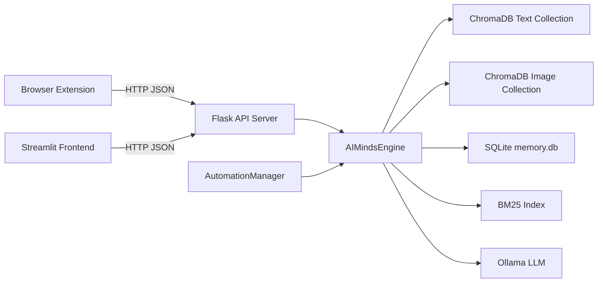
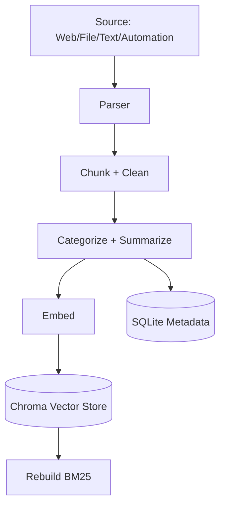
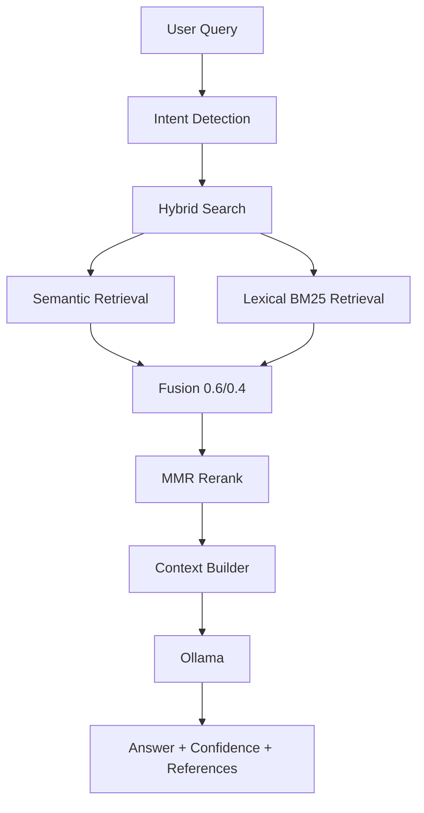

# GigaMind Architecture (Deep Technical Guide)

This document explains the full architecture of **ai-minds (GigaMind)** so you can later generate complete pipeline diagrams, workflow visuals, and system architecture assets.

---

## 1) System Goal

GigaMind is a **local-first personal knowledge system** that:

1. Ingests multimodal data (text, web pages, images, audio/video).
2. Converts content to embeddings and searchable records.
3. Stores memory persistently across restarts.
4. Answers user questions with a grounded RAG flow.
5. Adds automations for continuous capture (clipboard, folders, browser history, etc.).

No cloud API is required for core intelligence; the stack is local (Sentence Transformers + ChromaDB + SQLite + Ollama + optional Whisper).

---

## 2) High-Level Components

### A. Browser Extension (`ai-minds/extension`)
- Captures selected elements from pages (`/api/extract`).
- Captures full page text (`/api/auto-capture`).
- Allows quick query + digest from popup (`/query`, `/digest`).

### B. Backend API (`ai-minds/backend/server.py`)
- Flask + CORS API server on port `5000`.
- Exposes ingestion, query, stats, config, chat session, and automation endpoints.
- Boots engine + starts watcher + starts automations.

### C. Core Engine (`ai-minds/backend/engine.py`)
- Ingestion pipeline (chunking, categorization, optional action extraction).
- Embedding generation (text + image).
- Storage in ChromaDB + SQLite.
- Hybrid retrieval (semantic + BM25) and MMR reranking.
- LLM grounding with Ollama.
- Confidence + uncertainty scoring.

### D. Automations (`ai-minds/backend/automations.py`)
- Clipboard monitor.
- Browser history scanner.
- Screenshot watcher.
- Downloads watcher.
- Digest scheduler.
- Smart reminders.

### E. Frontend Dashboard (`ai-minds/frontend/app.py`)
- Streamlit app on port `8501`.
- Chat, dashboard, automations control, manual ingest, settings.

### F. Data Layer (`ai-minds/backend/data`)
- ChromaDB persistent vector indexes (`chroma/`).
- SQLite metadata/state (`memory.db`).
- BM25 cache (`bm25.pkl`).
- file-state tracking for watched directories (`file_state.json`).

---

## 3) Models Used

## Text Embedding Model
- Default: `BAAI/bge-small-en-v1.5`
- Loaded via `SentenceTransformer`.
- Used for:
  - semantic retrieval,
  - text chunk embeddings,
  - fallback embedding for image surrogate text.

## Image Embedding Model
- Default: `clip-ViT-B-32`
- Also loaded via `SentenceTransformer` (CLIP family).
- Used for:
  - image indexing to `image_collection`,
  - image similarity query (`/query/image`).

## LLM (Generation)
- Default: `qwen2.5:3b` via Ollama API (`/api/chat`).
- Used for:
  - grounded answers,
  - daily digest generation,
  - streaming answers (`/chat/stream`).

## Audio/Video Transcription
- `faster-whisper` (default model config: `small`, `cpu`, `int8`).
- Converts media to transcript text during ingestion; falls back to metadata-only if transcription fails.

---

## 4) Categories and Classification Logic

The engine classifies ingested content into one of these categories:

- `work`
- `learning`
- `finance`
- `health`
- `personal`
- `news`
- `code`
- fallback: `general`

### LLM-based categorization (primary)

Text content is categorized by calling Ollama with the **full source text** (up to ~1500 chars) plus source metadata (URL, file path, source type). This makes it **context-aware and file-aware** — the model sees the overall document, not isolated chunks, so a finance report that mentions "meetings" won't be misclassified as `work`.

- Prompt asks the LLM to respond with exactly one category word
- Uses `temperature: 0.0` and `num_predict: 12` for deterministic, fast responses
- Response is validated against the allowed category list

### Rule-based fallback

If Ollama is disabled or unreachable, a fast **keyword-matching fallback** (`_categorize_rules`) triggers. Each category has a keyword list; the first match wins.

### Image categorization

Images use the rule-based fallback only (minimal text context from filename/folder).

### Where categories are actually used

| Where | How |
|-------|-----|
| **SQLite `records.category`** | Stored per record for grouping |
| **ChromaDB chunk metadata** | Attached to every embedded chunk as `metadata.category` |
| **Dashboard stats** | Category counts displayed in bar chart |
| **Answer references** | Shown in `references[].category` so user sees which category a source belongs to |
| **Recent records** | Displayed in record list |

### Where categories are **NOT** used

- **Confidence scoring** — categories play no role.
- **MMR reranking** — purely embedding-distance based.

### Category-filtered retrieval (optional)

When a user specifies a category at query time (via the Streamlit dropdown or the `category` field in `/query` / `/chat/stream` payloads), retrieval is **scoped**:

- **Semantic search**: ChromaDB `where` filter limits results to `{"category": "<value"}`.
- **Lexical search (BM25)**: Each candidate's metadata is checked against the filter; non-matching docs are skipped.
- **LLM context**: Each snippet now includes `Category: <value>` so Ollama can reason about provenance.

If no category is specified, the system searches across all categories (original behavior).

**In short: categories are organizational by default but can optionally scope retrieval for more focused answers.**

---

## 5) Ingestion Architecture

## 5.1 Input Sources

### Web ingestion
- `/index`: memex-like clip payload (`textContent` + metadata).
- `/api/extract`: selected DOM elements + user note.
- `/api/auto-capture`: full page text capture.

### Manual ingestion
- `/ingest/text`: direct text.
- `/ingest/file`: local file path.

### Automated ingestion
- watcher over configured directories (`watch_dirs`).
- clipboard monitor.
- browser history monitor.
- screenshot watcher.
- downloads watcher.

## 5.2 File-Type Parsing

Supported modalities:
- Text/docs: `txt`, `md`, `log`, `csv`, `json`, `pdf`, `docx`
- Images: `png`, `jpg`, `jpeg`, `gif`, `webp`, `bmp`
- Audio: `mp3`, `wav`, `m4a`, `aac`, `flac`, `ogg`, `wma`
- Video: `mp4`, `mov`, `mkv`, `avi`, `webm`, `m4v`, `wmv`

Parsers:
- PDF: `pdfminer.six`
- DOCX: `python-docx`
- Audio/video: metadata + optional Whisper transcript

## 5.3 Text Ingestion Steps

1. Normalize and split into chunks (`chunk_size_chars`, default `800`).
2. Remove gibberish/noisy chunks.
3. Compute summary (first sentences).
4. Categorize by rule map.
5. Optionally extract actions/todos.
6. Embed with text model (`normalize_embeddings=True`).
7. Upsert into Chroma text collection.
8. Store metadata in SQLite records/actions tables.
9. Rebuild BM25 index cache.

## 5.4 Image Ingestion Steps

1. Build surrogate textual description from file name + folder.
2. Attempt CLIP image embedding and store in `image_collection`.
3. If image model unavailable/fails, fallback to text embedding in text collection.
4. Persist corresponding record in SQLite.

## 5.5 Media (Audio/Video) Ingestion

1. Create metadata block (type, name, extension, path, size, optional WAV duration).
2. Attempt Whisper transcript.
3. Concatenate metadata + transcript.
4. Send through normal text ingestion pipeline.

---

## 6) Embedding & Retrieval Internals

## 6.1 Embedding Normalization
Embeddings are generated with `normalize_embeddings=True`, enabling cosine-distance-friendly behavior in vector search.

## 6.2 Semantic Search
- Query text is embedded.
- Chroma query over `ai_minds_text` collection.
- Chroma cosine distance converted to similarity score:

`raw_similarity = max(0, 1 - distance)`

## 6.3 Lexical Search (BM25)
- Tokenized corpus built from stored documents.
- BM25 provides sparse/keyword relevance scores.
- BM25 scores are normalized to `[0,1]` for blending.

## 6.4 Hybrid Fusion
Semantic and lexical are fused:

`hybrid_score = 0.6 * semantic_norm + 0.4 * lexical_norm`

- Semantic-only docs stay in candidate set.
- Lexical-only docs can be pulled in and enriched from Chroma by ID.

## 6.5 MMR Reranking
Maximal Marginal Relevance balances relevance vs diversity:
- computes pairwise cosine similarity across candidate embeddings,
- greedily picks high-score but non-redundant items,
- returns final top-k context set.

---

## 7) RAG Answer Pipeline

For `/query`:

1. Detect query intent (`summary`, `actions`, `trace`, `automation`, fallback `qa`).
2. Apply optional category filter (from user request).
3. Run hybrid retrieval + MMR (scoped to category if specified).
4. Compute confidence from top raw semantic similarities (weighted).
5. Build context snippets from top results (including category labels).
6. Call Ollama chat API with system prompt + user question + context.
7. If Ollama fails/empty, use deterministic fallback answer builder.
8. Build `references` list filtered by `source_score_threshold`.
9. Attach uncertainty message if confidence below threshold.

Output includes:
- answer,
- confidence,
- uncertainty note,
- references with source/category/modality/snippet/score.

---

## 8) Confidence and Uncertainty

Confidence is estimated from retrieval quality (not model self-reported certainty):
- if one result: confidence = top raw score,
- else weighted top scores (e.g., `0.5, 0.3, 0.2`).

Low-confidence trigger:
- config `low_confidence_threshold` (default `0.35`).

Reference filtering:
- config `source_score_threshold` (default `0.2`).

Image similarity filtering:
- config `image_similarity_threshold` (default `0.2`).

---

## 9) Persistence Design

## ChromaDB
- `ai_minds_text`: text chunks + embeddings + metadata.
- `ai_minds_image`: image embeddings + metadata.

## SQLite (`memory.db`)
Tables:
- `records`: metadata per ingested chunk/item.
- `actions`: extracted action items, done flag.
- `automations`: automation configs/state (table exists for extensibility).
- `chat_sessions`: persistent chat sessions.
- `chat_messages`: persistent conversation history with confidence/references.

## Other persistent artifacts
- `bm25.pkl`: token corpus + doc IDs for BM25.
- `file_state.json`: watched-file mtimes for incremental scans.

---

## 10) Automation Architecture

Automations are independent daemon threads managed by `AutomationManager`.

## Available automation threads
- `clipboard`
- `browser_history`
- `screenshots`
- `downloads`
- `digest`
- `reminders`

## Operational behavior
- Start on backend boot according to config (`automations.start_all()`).
- Runtime control via `/automations/toggle` and `/automations/status`.
- Each automation has start/stop/restart/status methods.

## Notes
- Browser history uses copied DB approach to avoid lock issues.
- Screenshot/download watchers wait for file write completion before ingest.
- Digest scheduler can ingest generated digest back into memory as a new record.

---

## 11) API Surface (Architecture View)

## Health / config
- `GET /health`
- `GET /config`
- `POST /config`
- `POST /config/watch_dirs`

## Ingestion
- `POST /index`
- `POST /api/extract`
- `POST /api/auto-capture`
- `POST /ingest/text`
- `POST /ingest/file`
- `POST /ingest/scan`

## Query / chat
- `POST /query`
- `POST /query/image`
- `POST /chat/stream`
- `GET|POST /answer` (compat)

## Records/actions
- `GET /stats`
- `GET /records/recent`
- `GET /actions`
- `POST /actions/<id>/done`
- `POST /actions/cleanup`
- `POST /actions/purge`

## Chat persistence
- `GET /chat/sessions`
- `POST /chat/sessions`
- `DELETE /chat/sessions/<id>`
- `GET /chat/sessions/<id>/messages`
- `POST /chat/sessions/<id>/messages`

## Automations
- `GET /automations/status`
- `POST /automations/toggle`
- `GET /digest`

---

## 12) End-to-End Workflows (Diagram-Ready)

## Workflow A — Web Capture to Memory
1. User selects element(s) in extension.
2. Extension sends payload to `/api/extract`.
3. Backend converts selections to text block.
4. Engine ingests text (chunk, classify, embed, persist, reindex).
5. New memory is immediately queryable.

## Workflow B — Ask Question (RAG)
1. User asks in popup or Streamlit.
2. Backend `/query` receives question.
3. Engine retrieves hybrid candidates + reranks.
4. Engine builds grounded context and calls Ollama.
5. Backend returns answer + confidence + references.

## Workflow C — File/Folder Automation
1. Watch thread scans folder diffs using `file_state.json`.
2. New/changed file dispatched to parser by extension.
3. Parsed content ingested and indexed.
4. Stats/categories/actions update in dashboard.

## Workflow D — Media Ingestion
1. Audio/video file detected.
2. Metadata extracted.
3. Whisper transcription attempted.
4. Transcript+metadata treated as searchable text.

---

## 13) Mermaid Templates You Can Reuse

## 13.1 Component Diagram

## 13.2 Ingestion Pipeline

## 13.3 Query Pipeline

---

## 14) Configuration Parameters (Most Important)

From `backend/config.json`:
- `text_model_name`
- `image_model_name`
- `chunk_size_chars`
- `top_k`
- `low_confidence_threshold`
- `source_score_threshold`
- `image_similarity_threshold`
- `action_extraction_enabled`
- `transcription.*` (Whisper behavior)
- `watch_interval_seconds`
- `watch_dirs`
- `ollama.*`
- `automations.*`
- `system_prompt`, `persona`

These keys define most system behavior and are runtime-updatable via `/config`.

---

## 15) Practical Limits and Tradeoffs

- Rule-based categories are fast and interpretable but less nuanced than ML classifiers.
- BM25 rebuild on ingestion is simple but can become expensive with very large corpora.
- Confidence is retrieval-based and not guaranteed to match factuality.
- LLM grounding quality depends directly on retrieval quality + source cleanliness.
- Local-only setup improves privacy and control but requires local compute/resources.

---

## 16) Architecture Summary

GigaMind is a **hybrid local RAG system** combining:
- multimodal ingestion,
- vector + keyword retrieval,
- diversity reranking,
- grounded LLM responses,
- persistent memory,
- and background automations.

The architecture is modular enough to generate:
1. component diagrams,
2. sequence diagrams,
3. ingestion/query pipelines,
4. deployment diagrams,
5. operations dashboards.

This file is designed as the canonical source for producing those visuals next.
